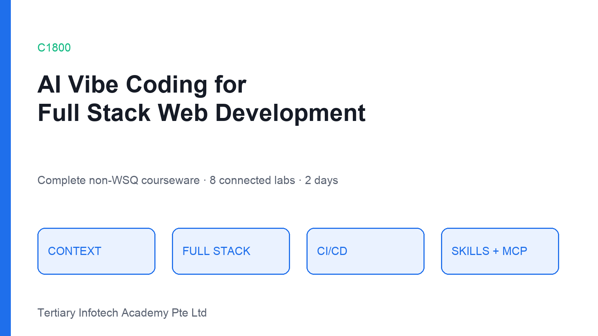
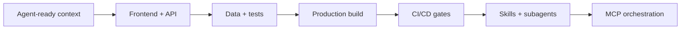

# C1800 — AI Vibe Coding for Full Stack Web Development

[](https://www.tertiarycourses.com.sg/vibe-coding-for-full-stack-web-development.html)
[](#courseware)
[](#courseware)

Complete non-WSQ courseware for a practical, intermediate programme on building and shipping full-stack web applications with AI coding agents.



## Courseware

- 158-slide PowerPoint deck following the supplied Tertiary five-slide lab standard across 30 guided labs
- Detailed 28,000+ word Learner Guide in DOCX and Markdown
- Two-day Lesson Plan totalling 15 instructional hours
- Thirty standalone lab sheets that progressively build the TaskFlow capstone
- Reusable, isolated `non-wsq-*` skills, commands, hooks and agents

## Learning journey



## Project structure

```text
courseware/          Generated PPT and DOCX deliverables
labs/                Eight learner lab sheets grouped by topic
scripts/             Reproducible courseware generator
.codex/skills/       Project-scoped non-WSQ Codex skills
.claude/             Project-scoped commands, hooks and agents
LEARNER-GUIDE.md     Searchable learner-guide source
```

## Regenerate and validate

```bash
python3 scripts/build_courseware.py
python3 .claude/hooks/non-wsq-courseware-post-hook.py .
```

Requires Python 3 with `python-docx`, `python-pptx` and Pillow.

## Source syllabus

The structure follows the published [C1800 course page](https://www.tertiarycourses.com.sg/vibe-coding-for-full-stack-web-development.html): vibe-coding principles, frontend/backend implementation, cloud and CI/CD, and agent skills/subagents/MCP.

## Credits

Developed for Tertiary Infotech Academy Pte Ltd. © 2026. All rights reserved.
